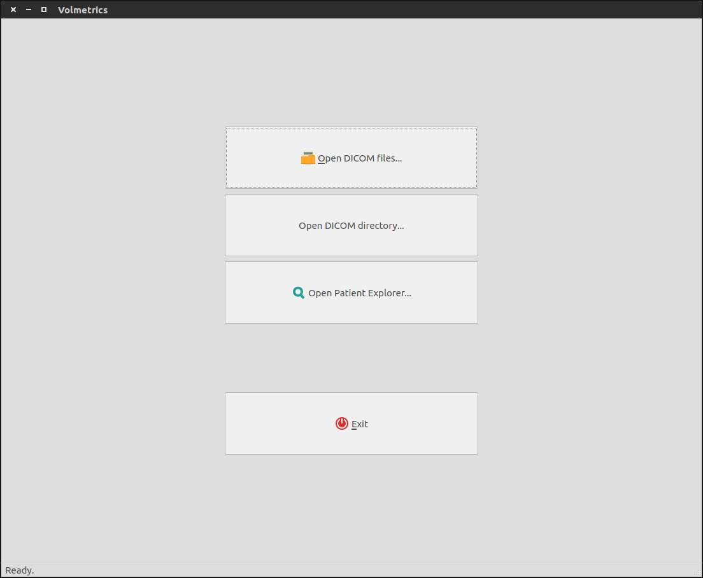
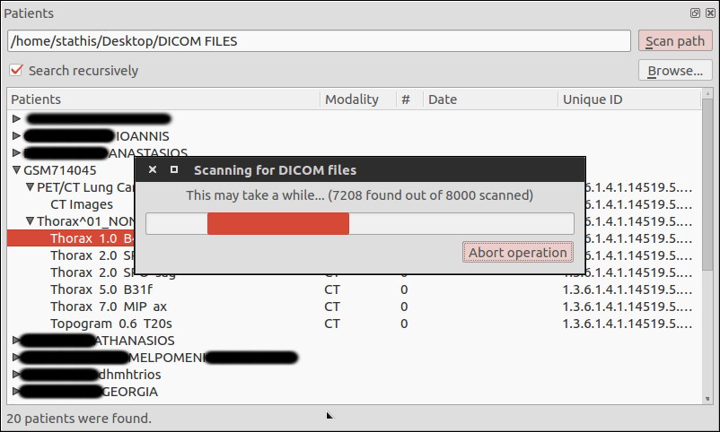
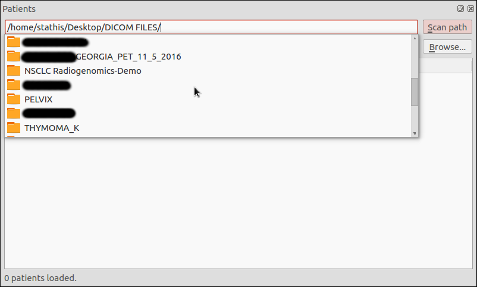
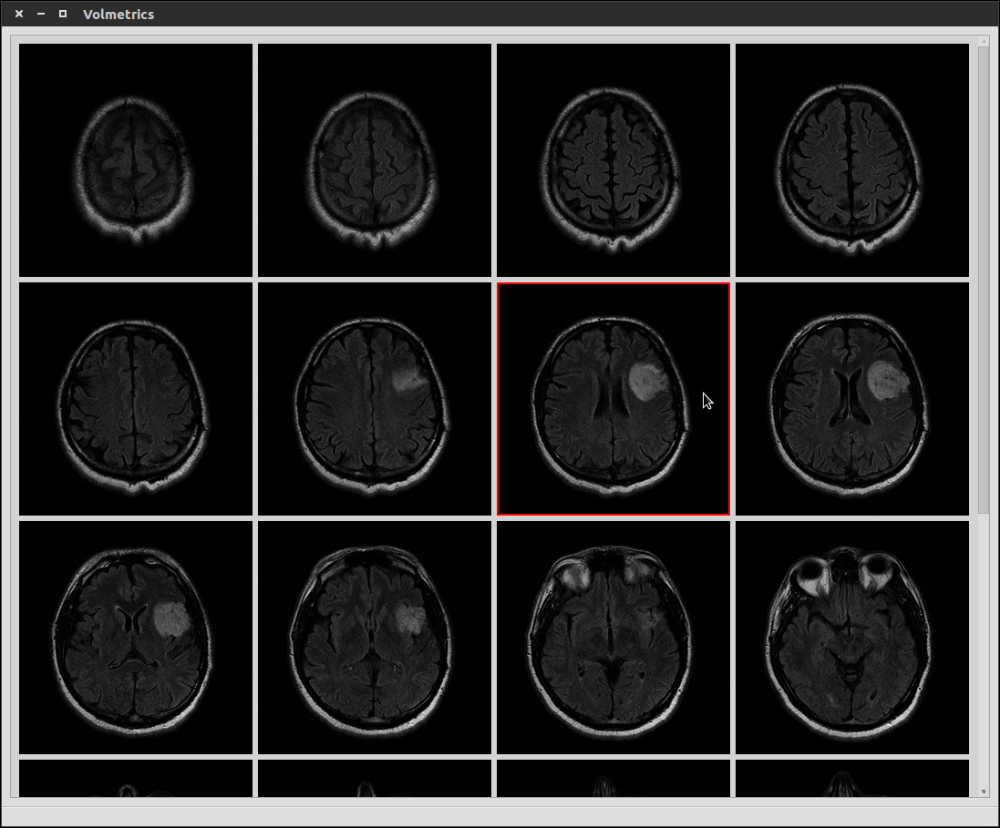
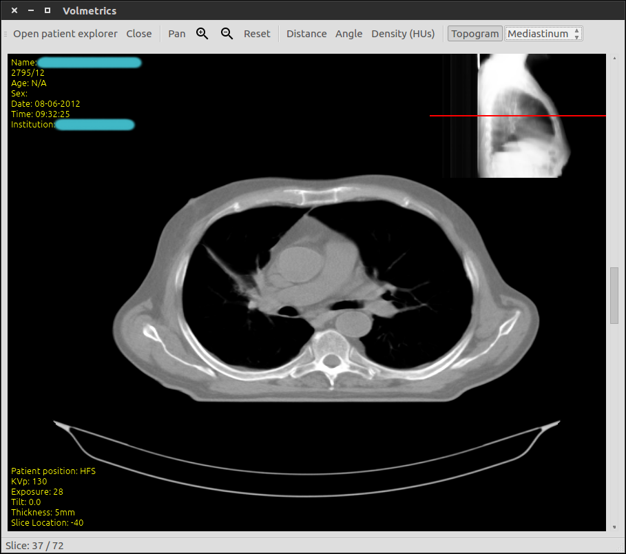
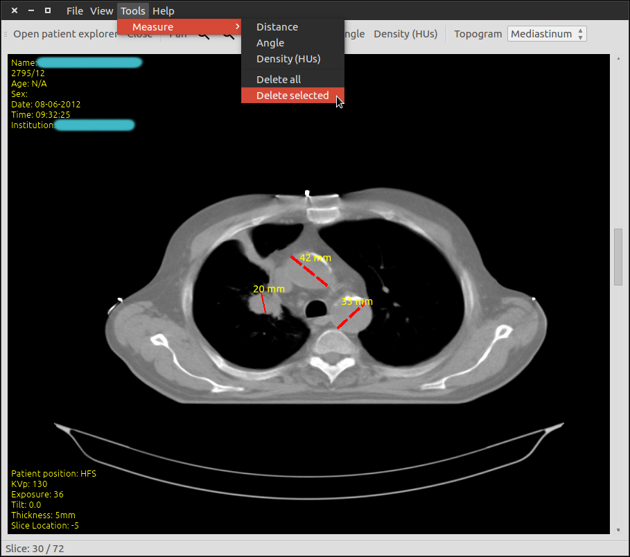
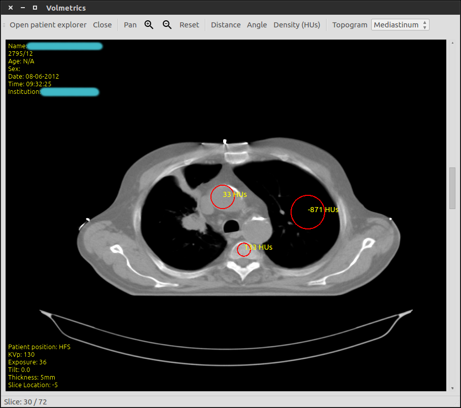

Table of Contents
# Introduction
The volmetrics project started as an endeavour to create a volumetric medical image software, in order to study certain geometrical aspects of malignant tumors. We had already done some prototyping on the matter with Mathematica and R.

This ended up being more a DICOM viewer.

# Features

* Cross platform application (tested in Linux and Mac OSX)
* Makes use of robust free/open source software (Qt for GUI, DCMTK for DICOM manipulation)
* OpenGL accelerated graphics operations with vertex shaders
* Multithreading in CPU/IO intensive tasks (e.g. traversing filesystem to find DICOM files), so that main thread doesn’t block and GUI remains responsive to user input
* Display both CT and MRI data sets
* Zoom in/out, pan, flip horizontally/vertically, reset
* Change window/width level by holding down mouse button and dragging
* Ability to generate scout topogram from any angle of view and use it for navigation
* Ability to measure HU over a circular region of interest
* Support for simple geometric operations, such as measuring distances in physical units
* Presets of CT window/width levels (abdomen, chest, bones, etc)
* Drag and drop support with preview of the item’s content that is dragged
* Floating layout when displaying a grid of images
* Dockable windows (patient explorer widget, topogram)
* Overlay of examination and patient details

# Screenshots
## Startup screen

## Patient explorer

## Autocompletion

## Floating grid layout

## Scout topogram

## Measure distances

## Measure HU in a ROI

